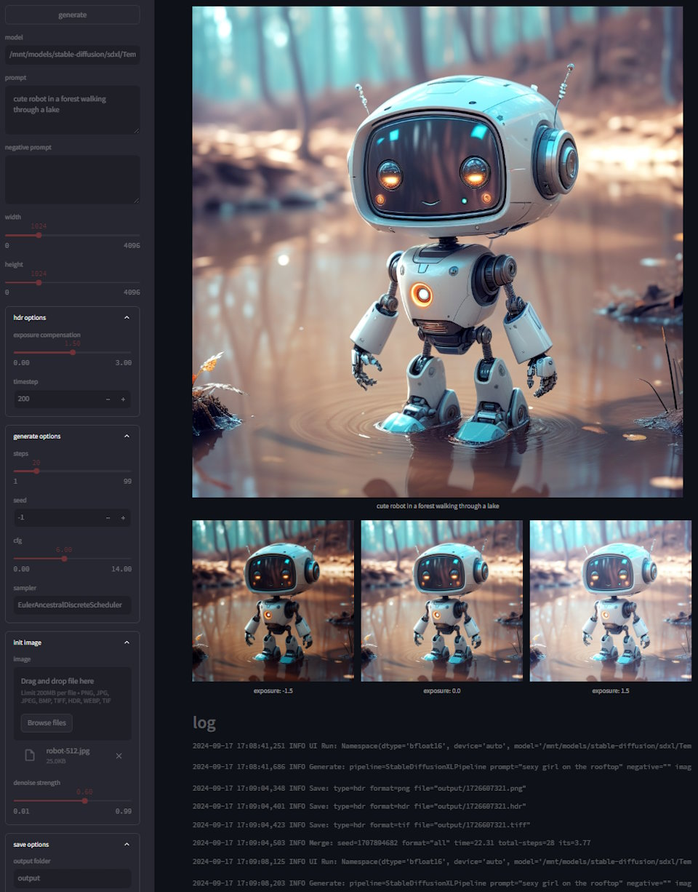

# HDR Image Generator

*Generate HDR images using StableDiffusionXL*  

How? By:

1. Running denoising loop for N-threshold steps
2. Store interim latents
3. Modifying latents to mimic exposure modifications
4. Finish running remaining steps
5. Repeat steps 3-5 for N-exposure steps
6. Merge N 8bit images into single 16bit HDR image

How fast is it? For standard 20 steps and with threshold of 0.2, it would run 16 base steps and then 3 x 4 steps for each different exposure for total of 28 steps - so 20% overhead.

## Run CLI

Primary mode of operation for batch operations is via wrappers that  

- create/activate `VENV`
- install `requirements.txt` (uses `uv` by default)  
- run main `hdr.py` script

Wrappers:

- Linux: `hdr.sh`
- Windows: `hdr.bat`

...or do it manually and run `hdr.py` script

> python hdr.py --help

```log
  --dtype DTYPE         torch dtype
  --device DEVICE       torch device
  --model MODEL         sd model
  --width WIDTH         image width
  --height HEIGHT       image height
  --steps STEPS         sampling steps
  --seed SEED           noise seed
  --cfg CFG             cfg scale
  --sampler SAMPLER     sd sampler
  --prompt PROMPT       prompt or prompts file
  --negative NEGATIVE   negative prompt or prompts file
  --image IMAGE         init image(s)
  --strength STRENGTH   denoise strength
  --output OUTPUT       output folder
  --format              hdr file format: png,hdr,dng,tiff,all
  --exp EXP             exposure correction
  --gamma GAMMA         gamma adjustment for dng/hdr
  --timestep TIMESTEP   correction timestep
  --save                save interim images
  --ldr                 create 8bpc hdr png image
  --json                save params to json
  --debug               debug log
  --offload             offload model components
```

> [!TIP]
> - `prompts`, `negative` can be actual strings or point to text file with one-prompt per line  
>   number of prompts and negative prompts do not need to be balanced  
> - `image` can be actual path to input image or point to text file with one image per line  

## Run UI

Experimental mode for, well, *experiments*  
Based on [streamlit](https://streamlit.io/) framework which is not installed by default as its not required for batch operations  

> source venv/bin/activate  
> pip install streamlit  
> streamlit run hdr.py  

> [!TIP]
> you can pass standard args to hdr.py by using additional `--` separator  
> *example*: `streamlit run hdr.py -- --model sdxl/model.safetensors  `



## Note

- A lot of optimizations are possible, this is just a quick and dirty script to get started  
- Notes: if input image(s) is present, it will run SDXL img2img pipeline, otherwise it will run text2img pipeline  
- Prompt, negative, image can be a string value or point to file which contains one line per entry  
- Created filename is simple epoch timestamp in output folder  
- Output formats: PNG / HDR / TIFF / DNG
